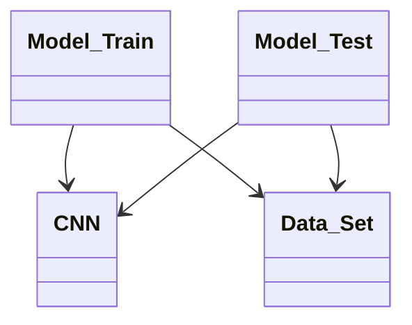

## 手写识别的面向对象实现

**类图**

```mermaid 
classDiagram 
    class Model_Test
        
    class Model_Train

    class Data_Set

    class CNN
    Model_Train --> CNN
    Model_Train --> Data_Set

    Model_Test --> CNN
    Model_Test --> Data_Set

```

**数据集来源**: NIST

**代码结构**:
|文件|功能|
|---|---|
|cnn.py|CNN实现|
|data_set.py|数据集|
|model_test.py|模型测试|
|train_step.py|模型训练|
|main.py|主函数|

